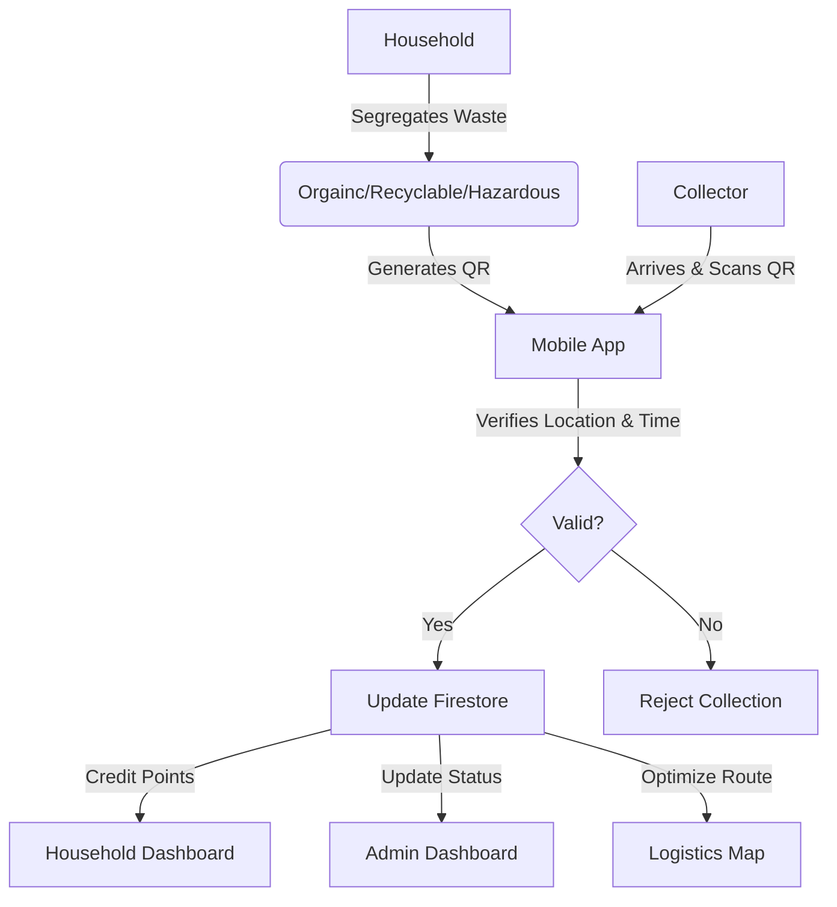
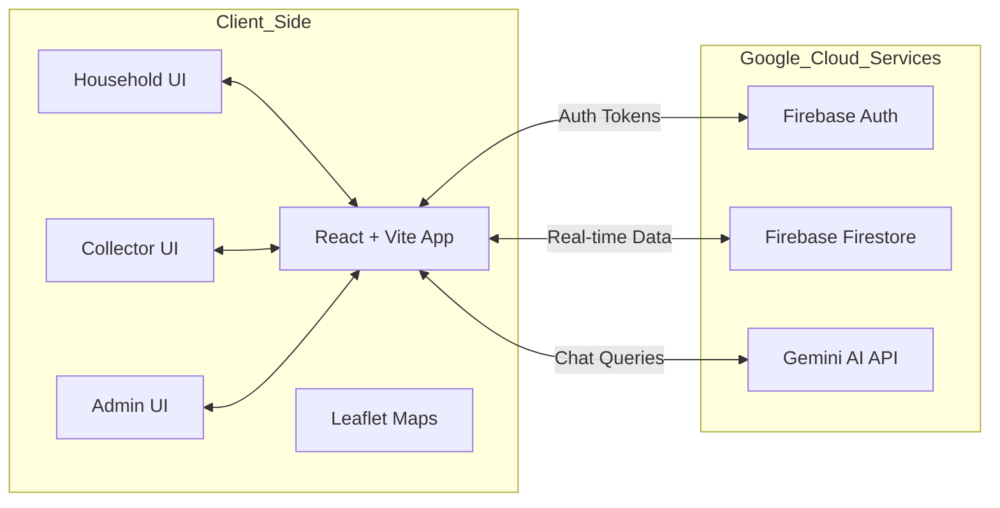

# Smart Waste 360 - Tamil Nadu Edition 🌍♻️

> **GDG TechSprint Hackathon Submission**

## 1. Solution & Problem Statement 🎯

### The Problem
*   **Inefficient Collection:** Municipalities lack real-time data on bin fill levels and collection vehicle routes, leading to overflowing bins and fuel wastage.
*   **Lack of Segregation:** Source segregation at the household level is inconsistent due to lack of awareness and incentives.
*   **Opaque & Disconnected:** No digital link between the waste generator (citizen) and the waste collector, making accountability impossible.

### The Solution: Smart Waste 360
*   A **comprehensive digital ecosystem** connecting Households, Waste Collectors, Municipal Officers, and State Administrators.
*   **AI-Driven & Data-Centric:** Utilizes **Google Gemini** for citizen assistance and real-time data for route optimization.
*   **Behavioral Change:** Gamifies waste segregation with reward points and ensures accountability through QR-based digital handshakes.

---

## 2. Opportunities & Differentiation 🚀

### How is it different?
*   **Competitors:** Focus primarily on *either* logistics tracking (fleet management) *or* citizen grievance reporting.
*   **Our Edge:** We close the loop. We integrate the **human element** (gamified segregation) with **operational efficiency** (live tracking) and **AI intelligence** (chatbot).
*   **Hyper-Local:** Built specifically for the Tamil Nadu context with native language support and localized administrative hierarchies.

### How it solves the problem?
*   **Proof of Service:** QR code scanning forces physical presence of collectors, eliminating "fake" collection reports.
*   **Incentivized Compliance:** Households segregate because they earn points (redeemable for tax credits/discounts), directly attacking the root cause of mixed waste.
*   **Proactive vs Reactive:** IoT-simulated bin data allows officials to clear bins *before* they overflow, shifting from complaint-based to data-based management.

---

## 3. Key Features ✨

*   **👥 Role-Based Access Control:** tailored dashboards for 4 distinct user types (Household, Collector, Officer, State Admin).
*   **🤖 AI Smart Assistant:** Built with **Google Gemini**, helping users identify waste types and answer queries in natural language.
*   **📸 AI Image Analysis:** Uses **Gemini Vision** to auto-classify waste types and assess urgency from photos uploaded by collectors.
*   **📍 Real-Time Monitoring:** Interactive maps visualizing bin fill-levels, collection routes, and blackspots.
*   **📱 QR-Based Verification:** Secure digital handshake between household and collector to verify waste pickup.
*   **🏆 Gamification Engine:** Reward system to encourage consistent waste segregation practices.
*   **🗣️ Multilingual Support:** Full support for Tamil and English to ensure accessibility for all citizens.

---

## 4. Google Technologies Used 🛠️

*   **🔥 Firebase:**
    *   **Authentication:** Secure, seamless user identity management for all roles.
    *   **Firestore:** Real-time NoSQL database for syncing bin status, routes, and user points instantly across devices.
*   **🧠 Google Gemini AI:**
    *   **Multimodal Capabilities:** Uses **Gemini 2.5 Flash** for high-speed image analysis (Vision) to detect hazardous waste and bin overflows from photos.
    *   **Smart Chat:** Context-aware responses for citizen inquiries.
*   **🗺️ Google Maps Platform:**
    *   **Heatmaps:** Visualizes waste generation density and blackspots for strategic resource allocation.
    *   **Interactive Maps:** Dynamic location tracking for bins and collection vehicles.

---

## 5. Process Flow Diagram 🔄



---

## 6. Wireframes / User Interface 🖼️

*   **Household View:** Clean interface showing waste history, next pickup slot, and accumulated reward points.
*   **Collector View:** "My Route" map navigation with prioritized stops based on efficiency.
*   **Admin Dashboard:** 'Mission Control' style view with live map of the city, showing green (empty) vs red (critical) bins.
*   **State Dashboard:** High-level aggregation of district-wise performance metrics (Chennai vs Coimbatore vs Madurai).

> *The solution implements a "Glassmorphism" design language with a Tamil Nadu government color theme (Blue/Green/White) for a premium, modern feel.*

---

## 7. Architecture Diagram 🏗️



---

## 8. Future Development 🔮

*   **IoT Integration:** Connecting physical ultrasonic sensors in bins directly to the Firebase backend.
*   **Predictive Logistics:** ML models to predict waste generation spikes during festivals (e.g., Pongal, Diwali).
*   **Offline Support:** Making the Collector app fully functional in low-network zones using Firestore offline persistence.

---

## 9. Setup & Installation ⚙️

1.  **Clone the Repository**
    ```bash
    git clone https://github.com/your-username/smart-waste-360.git
    cd smart-waste-360
    ```

2.  **Install Dependencies**
    ```bash
    npm install
    ```

3.  **Environment Configuration**
    *   Create a `.env` file in the root directory.
    *   Add your Google Gemini API Key:
        ```env
        VITE_GEMINI_API_KEY=your_actual_api_key_here
        ```
    *   *Note: See `.env.example` for reference.*

4.  **Run Application**
    ```bash
    npm run dev
    ```

---
*Built with ❤️ for a Cleaner Tamil Nadu.*
