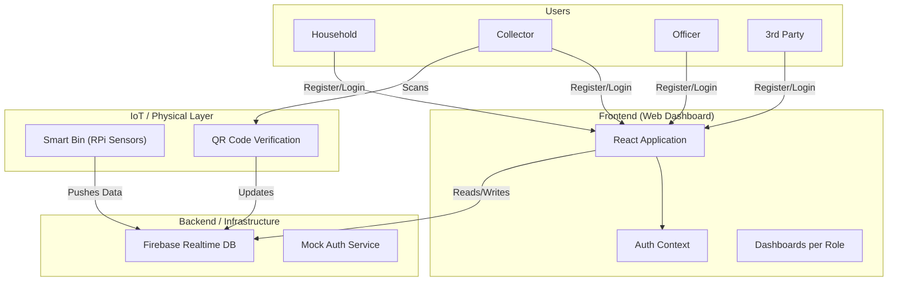
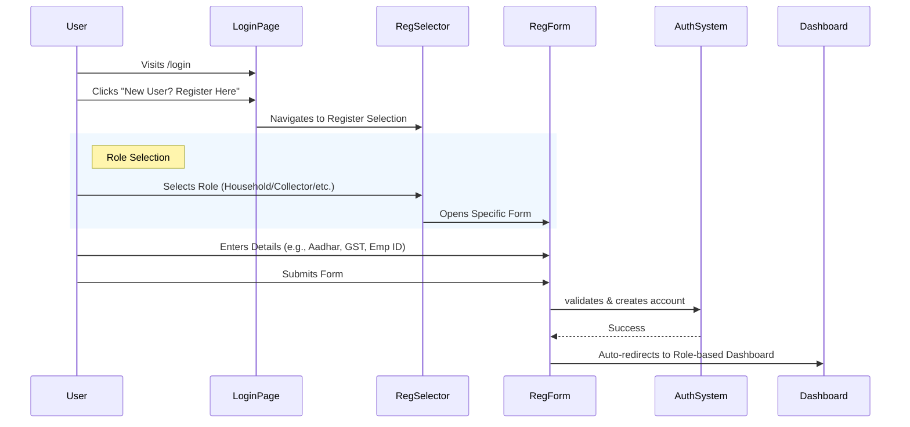
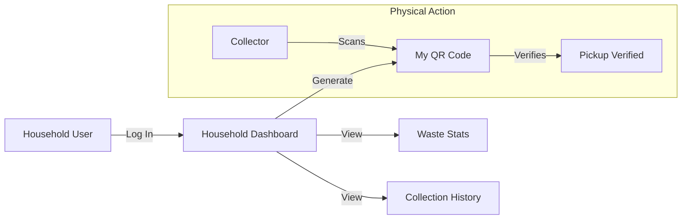
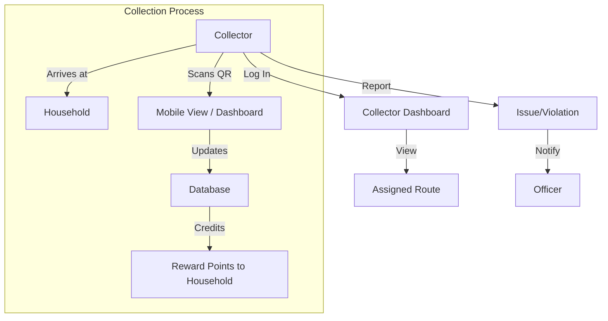
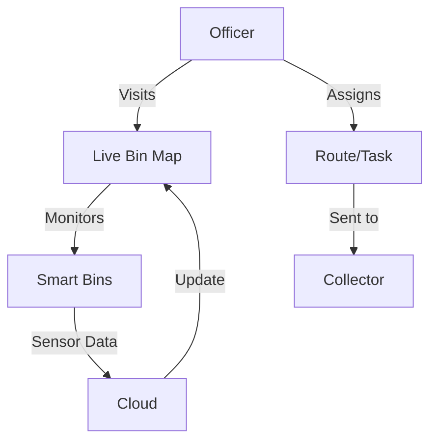
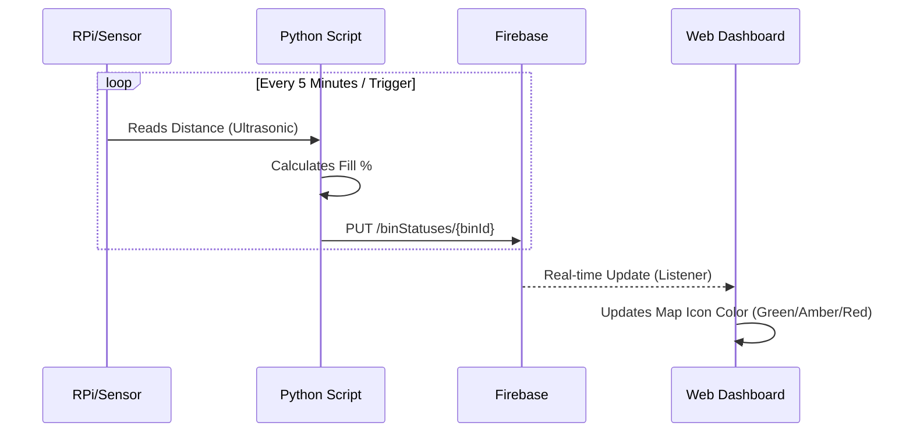

# System Architecture & Workflow

This document outlines the end-to-end workflow of the Odisha Smart Bin Waste Management System (Sujog). It is designed to help visualize the system for flowcharts and architectural diagrams.

## 1. High-Level System Overview

The system connects four key stakeholders: **Households**, **Waste Collectors**, **Municipal Officers**, and **3rd Party Partners**. It leverages IoT sensors (Smart Bins) and a Web Dashboard for real-time monitoring and management.

---

## 2. User Registration & Authentication Flow

All users must authenticate to access their specific dashboards. The system supports a "New User Registration" flow.

---

## 3. Household Workflow

**Goal**: Monitor own waste generation, view history, and ensure pickup.

1.  **Registration**: User provides Ward, Street, House No, Aadhar, EB Number.
2.  **Dashboard**:
    *   View waste generation history.
    *   Check reward points.
    *   Download QR Code (for collector validation).
    *   View notifications/announcements.

---

## 4. Collector Workflow

**Goal**: Efficiently collect waste from assigned routes and report status.

1.  **Registration**: User provides Employee ID, Collector ID.
2.  **Dashboard**:
    *   View assigned route (Ward/Street).
    *   **QR Scan**: Scan household QR to verify pickup.
    *   Report issues (e.g., "Bin Broken", "Mixed Waste Violation").
    *   Mark attendance.

---

## 5. Municipal Officer Workflow

**Goal**: City-wide monitoring, resource allocation, and anomaly detection.

1.  **Registration**: User provides Govt ID, Department.
2.  **Dashboard**:
    *   **Live Map**: View status of all Smart Bins (Full/Empty/Critical).
    *   **Analytics**: View total waste collected, efficiency metrics.
    *   **Management**: View lists of Households and Collectors.
    *   **Reports**: Export data for official use.

---

## 6. 3rd Party Partner Workflow

**Goal**: Monitor specific zones assigned to private entities.

1.  **Registration**: User provides Partner Name, GST Number.
2.  **Dashboard**:
    *   View aggregate stats for assigned zones.
    *   View specific "Partner Map".
    *   Access limited reports.

---

## 7. IoT Data Flow (Smart Bin)

Sensors in the bin measure fill level and send data to the cloud.

## 8. Data Structures

*   **HouseholdUser**: `id`, `ward`, `street`, `house`, `aadhar`, `ebNumber`, `points`.
*   **SmartBin**: `id`, `location (lat, lng)`, `fillLevel`, `status`, `lastUpdated`.
*   **WasteLog**: `id`, `householdId`, `collectorId`, `wasteType`, `weight`, `timestamp`.
*   **Collector**: `id`, `employeeId`, `assignedWard`.
*   **Officer**: `id`, `govtId`, `role`.
*   **ThirdParty**: `id`, `gstNumber`, `partnerName`.
